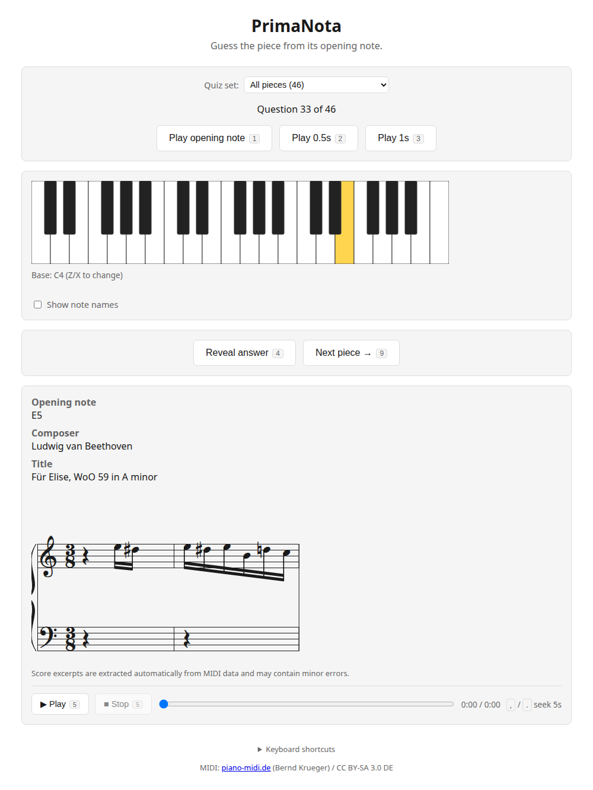

# PrimaNota

A front-end-only web app: listen to the "opening note" of a classical piano
masterpiece, check it against the on-screen keyboard, and guess the note
name, composer, and title.



## Overview

- Plays a randomly chosen piece's opening note (single note or chord) at one
  of three lengths — chord only / 0.5s / 1s — through a SoundFont synth that
  reproduces the actual performance
- Lets you play freely on the on-screen piano keyboard, by click or with a
  PC keyboard (QWERTY layout); there's no correctness check on this. Holding
  Ctrl lets notes ring like a sustain pedal
- "Reveal answer" shows the note name, composer, title, and a short score
  excerpt, and highlights the matching key(s)
- Once revealed, the whole piece can be played back, stopped, and seeked
- One-key shortcuts cover the main actions (preview, reveal, next piece,
  playback), so the app can be operated entirely from the keyboard without
  touching the mouse
- A "Quiz set" dropdown narrows the question pool to a featured set (e.g.
  "Most Famous") or a single composer, instead of always drawing from all
  pieces; the choice is remembered across visits

## Structure

This repository has two parts:

- `tools/` — offline preprocessing (Python) that fetches and analyzes MIDI
  data and builds the dataset
- `web/` — the quiz web app itself (Vite + TypeScript)

The two are connected only through `web/src/data/pieces.json`, the
preprocessing output; the web app never touches MIDI files at runtime.

## Setup

### Preprocessing (`tools/`)

```
cd tools
python3 -m venv .venv
source .venv/bin/activate
pip install -r requirements.txt
```

Run the following in order to go from downloading MIDI files to generating
the dataset (`data/midi/` is not tracked in Git, so you'll need to re-fetch
it locally):

```
python3 fetch_catalog.py      # Fetch the piece list from piano-midi.de -> catalog_raw.yaml
python3 download_midi.py      # Download the 46 pieces listed in catalog.yaml
python3 analyze_midi.py       # Extract the opening notes -> report.md
python3 build_dataset.py      # Generate web/src/data/pieces.json and web/public/playback/*.mid
```

To add or remove a single piece afterwards, use `manage_piece.py` instead of
running the steps above by hand — it wraps them and also cleans up files that
`build_dataset.py` alone would leave behind:

```
python3 manage_piece.py add            # interactively add one piece (downloads its
                                        # MIDI, analyzes it, regenerates pieces.json)
python3 manage_piece.py remove <id>    # remove one piece and its derived files
                                        # (data/midi, data/analysis, web/public/playback)
```

`add` only accepts a `piano-midi.de` `.mid` URL, to keep the CC BY-SA licensing
described below intact. If the analysis reports a warning (e.g. the detected
opening note looks wrong), it prints what to add to `data/overrides.yaml` —
this still requires a human to verify the correct notes by ear or score,
so it is not done automatically.

Quiz sets shown in the app's "Quiz set" dropdown are generated by
`build_dataset.py`: one per composer automatically, plus any curated,
cross-composer set listed by hand in `data/piece_sets.yaml` (e.g. "Most
Famous"). Add a piece to a curated set by adding its id to that set's
`piece_ids` in `data/piece_sets.yaml`, then re-run `build_dataset.py`.
`manage_piece.py remove` keeps this file in sync automatically.

### Web app (`web/`)

```
cd web
npm install
npm run dev      # dev server
npm run build    # production build (dist/)
```

## Data sources and licensing

The pieces themselves (Bach, Chopin, etc.) are all public-domain works whose
copyright term has expired everywhere. The licensing notes below concern the
**MIDI data** (the recorded performance information), not the compositions
themselves.

The MIDI data is used from [piano-midi.de](http://piano-midi.de/) (Bernd
Krueger), under the
[CC BY-SA 3.0 Germany](http://creativecommons.org/licenses/by-sa/3.0/de/deed.en)
license. [copy.htm](http://piano-midi.de/copy.htm) spells out two
requirements: "attribute the copyright holder (Bernd Krueger) and the
source (http://www.piano-midi.de)" and "redistribute or publicly perform it
— including adaptations — only under the same license." The former is
satisfied in the app footer; the latter is satisfied by this section and by
`web/src/data/LICENSE` / `web/public/playback/LICENSE` (below).
Both the 3-tier opening-note preview and the full-piece playback in the
answer panel use derivative MIDI files that we regenerate ourselves from
note pitch/duration and pedal data — never the original MIDI files — stored
in `web/public/playback/` as, per piece, `<id>.mid` (whole piece),
`<id>_chord.mid` (chord only), `<id>_0500.mid` (0.5s), and `<id>_1000.mid`
(1s). The sound made when you click or type on the on-screen keyboard is
produced separately, by this project's own additive synth (no sampled
audio) — not by these derivative MIDI files.

The opening-note preview and answer-panel playback use the following
third-party software:

- [spessasynth_lib](https://github.com/spessasus/spessasynth_lib) (Apache
  License 2.0) — a SoundFont-based MIDI playback library
- [GeneralUser GS](https://github.com/mrbumpy409/GeneralUser-GS) (S.
  Christian Collins, GeneralUser GS License v2.0) — a SoundFont including a
  piano voice. Free to modify and redistribute for both private and
  commercial use, with no attribution requirement (the only request is not
  to hotlink the author's own download files, which this repository avoids
  by bundling the file locally). The full license text is included at
  `web/public/soundfonts/GeneralUser-GS-LICENSE.txt`

## License

This repository's source code (`tools/`, `web/`, excluding the below) is
released under the MIT License.
Derivative data from the MIDI source (the pitch/duration/score information
in `web/src/data/pieces.json`, and the derivative MIDI files in
`web/public/playback/`) inherits the source data's license (CC BY-SA 3.0
Germany, above) instead of MIT. To avoid it being mistaken for MIT-licensed
code, `web/src/data/LICENSE` and `web/public/playback/LICENSE` each spell
out their scope and license terms. The bundled SoundFont
(`web/public/soundfonts/`) is under yet another license (GeneralUser GS
License v2.0), as noted above.
